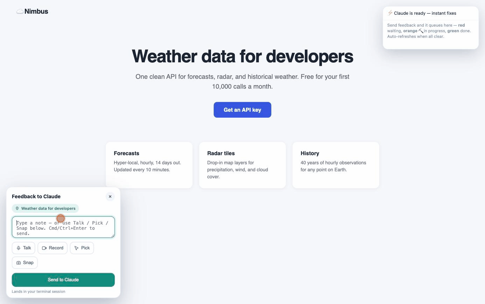

<div align="center">

# 🗣️ YapUI

### Yap at your UI. Watch Claude rebuild it live.

Preview any HTML in your browser and give feedback by **talking, pointing, recording, screenshotting, or typing** — [Claude Code](https://claude.com/claude-code) picks it up in real time, fixes it, and replies right in the page. You never go back to the terminal.

[](LICENSE)
[](https://code.claude.com/docs/en/skills)
[](#contributing)



*Say "make the hero bigger and the button red" — and watch it happen.*

</div>

---

## Why YapUI?

`open file.html` is a dead end: `file://` blocks the mic and screen capture, and there's no way to tell the AI what to change without typing it all back into the terminal.

YapUI replaces that with a **live, two-way feedback loop**:

- 🗣️ **Talk to your page** — dictate a change out loud while pointing at the thing you mean.
- 🎯 **Point & pick** — click an element to attach it to your note, so *"make **this** bigger"* just works.
- 🎬 **Record** a janky animation, 📸 **snap** a screenshot, or ⌨️ **type** a plain note.
- 👀 **Claude is watching** — an ambient indicator shows when Claude is idle, working, or done.
- 🔁 **It replies in the browser** and the page refreshes itself — no terminal round-trips.

It's not just a live server. It's the *conversation* on top of one.

## Install

### Option A — clone into your skills folder (simplest)

```bash
git clone https://github.com/Tatendaz/yapui ~/.claude/skills/yapui
```

That's it — Claude Code auto-discovers the skill on next launch.

### Option B — install as a plugin

```bash
/plugin marketplace add Tatendaz/yapui
/plugin install yapui@yapui-marketplace
```

## Usage

Just ask Claude to preview some HTML:

```
preview index.html
```
```
open my mockup in the browser
```

Claude launches the local relay, opens the page — and the relay boots a **resident, pre-warmed Claude agent** that owns the feedback loop. Then, in the browser:

1. Hit the **Feedback** button (bottom-left, or press `f`).
2. Choose **⌨️ type · 🎙 Talk · 🎬 Record · 📸 Snap · 🎯 Pick** and send.
3. Your note flips to 🟠 working in **~40 ms**, with a live line showing what the agent is doing ("✏️ editing index.html…"). Cards go 🔴 queued → 🟠 working → ✅ done; when every card is green, the page auto-refreshes with your changes.

Mic / screen-share prompts are normal — **everything stays on your machine.**

## Why it's fast

The old loop was: browser → file → a shell watcher polling every second → your *main* Claude session waking up → several tool round-trips before anything visibly happened. Tens of seconds of dead air.

Now the relay itself keeps a **headless `claude` agent alive and primed on your HTML** (`relay/agent.js`). A note is piped straight into the agent's stdin the instant it lands; task flips, live activity, and replies stream back to the page over **SSE** — no polling anywhere on the hot path.

- **~40 ms** from *send* to the card showing ⛏️ working
- **A few seconds** from *send* to fix-applied + reply (model time only)
- The agent keeps session context, so "now make **that** one blue too" just works
- Notes sent while it's busy queue honestly and dispatch the moment it frees up
- No `claude` CLI on PATH (or `YAP_AGENT=off`)? It gracefully falls back to the classic watcher mode — same UI, driven from your main session

## How it works

YapUI is a `SKILL.md` plus a tiny local relay — no build step, no framework, zero npm dependencies:

| File | Role |
| --- | --- |
| `relay/server.js` | Serves your HTML over `http://localhost` (so mic + screen capture work), injects the widget, and pushes every update to the browser over SSE (`/events`). Re-reads the file on each load, so edits show up on refresh. |
| `relay/agent.js` | The resident fix agent: spawns headless `claude` (stream-json over stdin/stdout), pre-warms it on your HTML, queues/coalesces notes, streams a live activity ticker, posts the reply, recycles itself after N turns, and respawns on crashes. |
| `relay/widget.js` | The in-page feedback panel, the "⚡ Claude is ready" indicator, and the live task queue (SSE-driven; falls back to polling only if the stream drops). |
| `relay/flip-status.js` | Lets your main Claude session drive the queue cards in watcher-fallback mode. |
| `SKILL.md` | Tells Claude how to launch the relay, check which mode is active (`GET /agent`), and run the watcher fallback when there's no resident agent. |

Feedback artifacts (notes, recordings, screenshots) are written to a `.yapui/` folder next to your HTML — safe to delete or gitignore.

### Tuning

Set these on the relay process:

| Env | Default | What it does |
| --- | --- | --- |
| `YAP_AGENT` | on | `off` disables the resident agent (classic watcher mode) |
| `YAP_AGENT_MODEL` | `sonnet` | Model for fixes — `haiku` for maximum speed, `opus` for gnarly pages |
| `YAP_CLAUDE_BIN` | `claude` | Path to the Claude Code CLI |
| `YAP_AGENT_RECYCLE` | `30` | Turns before the agent is recycled (keeps context lean) |
| `YAP_AGENT_TIMEOUT` | `240` | Seconds of mid-turn silence before a hung agent is restarted |

The agent runs `--permission-mode acceptEdits` restricted to `Read,Edit,Write,MultiEdit,Grep,Glob,Bash(ffmpeg:*)`, working only in the served HTML's directory — it can edit files there without prompting, and nothing else.

## Requirements

- **Node.js** — the relay is plain Node with zero dependencies.
- **Claude Code** (`claude` on PATH) for instant mode — without it YapUI falls back to watcher mode.
- A **Chromium-based browser** (Chrome / Edge / Brave) for voice + screen recording (Web Speech + `getDisplayMedia`).
- **`ffmpeg`** — only if you want Claude to read screen recordings.
- Internet access for the screenshot library (`html2canvas`, loaded via CDN).

## Repo layout

```
yapui/
├── SKILL.md              # the skill: launch, mode check, watcher fallback
├── relay/
│   ├── server.js         # local HTTP relay + widget injector + SSE push
│   ├── agent.js          # resident pre-warmed fix agent (headless claude)
│   ├── widget.js         # in-browser feedback panel + live status UI
│   └── flip-status.js    # queue-card status driver (fallback mode)
├── test/
│   ├── e2e.test.js       # full-loop tests (npm test) — no API calls
│   └── fake-claude.js    # deterministic stand-in for the claude CLI
└── .claude-plugin/       # makes it /plugin-installable
    ├── plugin.json
    └── marketplace.json
```

## Tests

```bash
npm test
```

Runs the whole loop against a fake `claude` binary that speaks the real stream-json protocol — feedback in, status flips, live ticker, HTML edit, reply out, SSE push, plus the watcher fallback — deterministically, with no API calls.

## Contributing

Issues and PRs welcome — especially new feedback modes and browser-state polish.

## License

MIT © [Tatendaz](https://github.com/Tatendaz)
