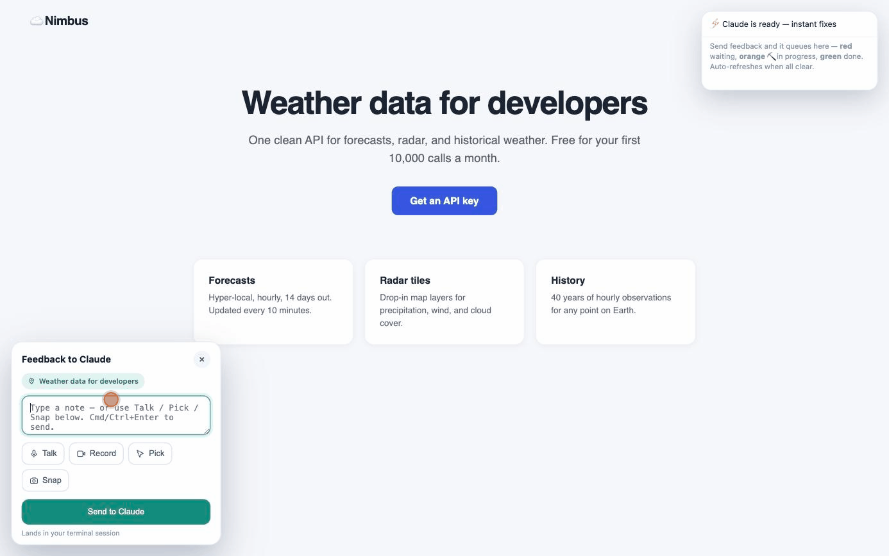

<div align="center">

# 🗣️ YapUI

**Yap at your UI. Watch Claude rebuild it live.**

A [Claude Code](https://claude.com/claude-code) skill that previews your HTML in a real
browser and puts a two-way feedback loop on top of it. **Talk, point, record, screenshot
or type** — a resident agent picks your note up the instant you hit send, edits the file,
and replies in the page. Plain Node, zero npm dependencies, no build step.

[](LICENSE)
[](https://code.claude.com/docs/en/skills)
[](CONTRIBUTING.md)



*Say "make the hero bigger and the button red" — and watch it happen.*

</div>

---

`open file.html` is a dead end: `file://` blocks the mic and screen capture, and there's no
way to tell the AI what to change without typing it all back into the terminal. YapUI is
the *conversation* on top of a live server.

## Install

Needs **Node 20+**, a **Chromium browser** (Chrome / Edge / Brave) for voice and recording,
and the **`claude` CLI** for instant mode. Pick one route:

```bash
npx skills add tatendaz/yapui                                       # any agent — add -g for all your projects
git clone https://github.com/Tatendaz/yapui ~/.claude/skills/yapui  # personal, all your projects
git clone https://github.com/Tatendaz/yapui .claude/skills/yapui    # this repo, shareable with your team
```

Or as a plugin, from inside Claude Code:

```text
/plugin marketplace add Tatendaz/yapui
/plugin install yapui@yapui-marketplace
```

Then look for `/yapui` in the slash-command list. Not there? Run `/reload-plugins`, or
restart Claude Code once.

**Or have an agent install it** — paste this into Claude Code:

> Install the YapUI skill: clone `https://github.com/Tatendaz/yapui` into
> `~/.claude/skills/yapui`, confirm `SKILL.md` exists there, then tell me how to use it.

Requirements in full, all four routes, verification, update and uninstall →
**[Installing YapUI](docs/guide/install.md)**.

## Use it

Ask Claude to preview some HTML — or invoke the skill directly with `/yapui`:

```
preview index.html
```

Claude starts the local relay, opens the page, and boots a pre-warmed agent that owns the
feedback loop. The panel is already open: choose **⌨️ type · 🎙 Talk · 🎬 Record ·
📸 Snap · 🎯 Pick** and send. Your card goes 🔴 queued → 🟠 working → ✅ done, and when
they're all green the page refreshes itself.

## Docs

| | |
| --- | --- |
| [How it works](docs/guide/how-it-works.md) | The relay, the resident agent, and why it's ~40 ms to first status |
| [Configuration](docs/guide/configuration.md) | Env vars, model choice, and what the agent is allowed to touch |
| [What leaves your machine](docs/guide/privacy.md) | Stored locally vs. sent to the Anthropic API |
| [Troubleshooting](docs/guide/troubleshooting.md) | Watcher mode, ports, mic permissions, `ffmpeg` |
| [Contributing](CONTRIBUTING.md) | 30-second dev setup, zero dependencies to install |

Issues and PRs welcome — especially new feedback modes and browser-state polish. Bugs and
ideas go through the [issue templates](https://github.com/Tatendaz/yapui/issues/new/choose);
security reports go [privately](SECURITY.md).

## License

MIT © [Tatendaz](https://github.com/Tatendaz)
